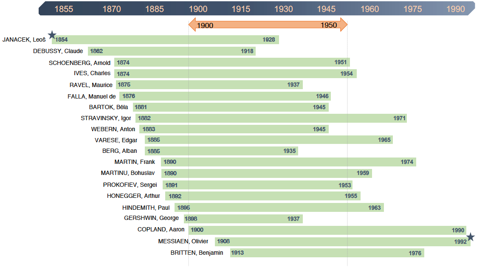

	

		

			

				<h5 class="category mb-2 card-title">Timeline of Composers by Birth Year</h5>
				
The timeline graph represents the lifetime of the twenty composers featured in the corpus (shown with green bar), organized by birth year. The composer with the earliets birth year is Leoš Janáček (1854, shown with a blue star), while the composer with the latest death year is Olivier Messiaen (1992, shown with a blue star). Although the corpus includes pieces representative of each of the creative periods of the composers' lifetime up to 1980, the majority of pieces fall within the 1900-1950 focus period (shown with orange arrow). The graph emphasizes the different creative periods that correspond to the focus period. For example, the focus period corresponds to the middle to late periods for Claude Debussy, while it corresponds to the early to middle period of Benjamin Britten. The focus period also captures some composers' entire creative output, such as that of George Gershwin and Arthur Honegger. The alignment of composers' lifetime and their creative periods also suggests possible encounters between composers as well as familiarity with other composers' output.

			

		

		

			
		

	

	

		

			
		

		

			

				<h5 class="category mb-2 card-title">Birth Region or Country</h5>
				
Description goes here

			

		

	

	

		

			

				<h5 class="category mb-2 card-title">Death Region or Country</h5>
				
Description goes here

			

		

		

			
		

	

