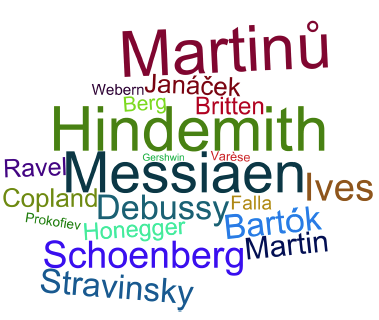
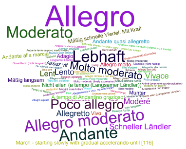
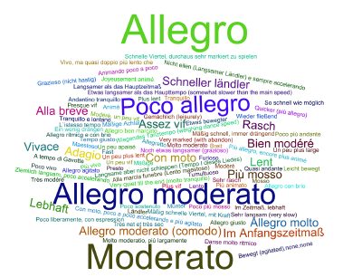
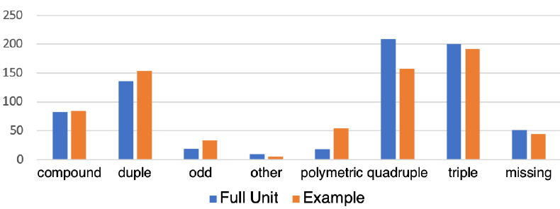
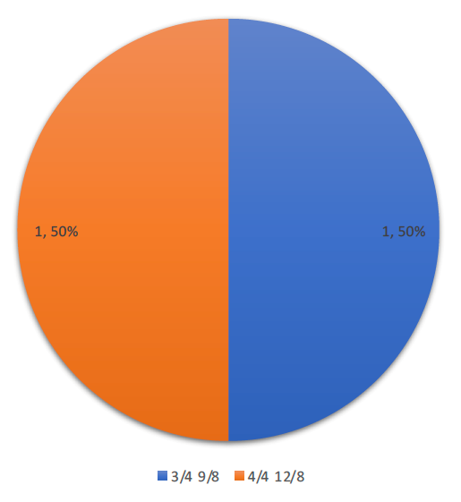
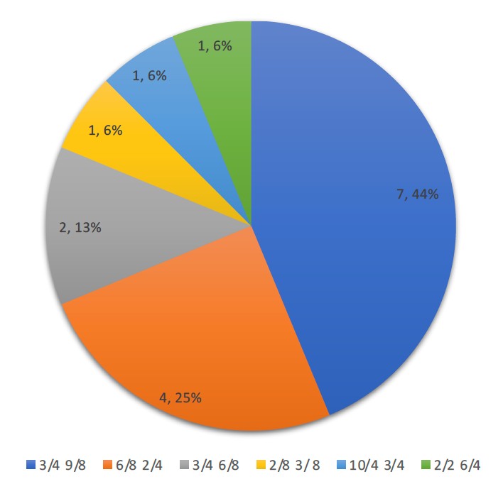

	

		

			

				<h5 class="category mb-2 card-title">Examples by Composers</h5>
				
The distribution of corpus examples by composer is similar to the distribution of source works by composer, although there are some differences. One prominent difference is the number of examples by the French composer Olivier Messian (68 examples extracted from 21 works), which is in part due to the larger number of examples extracted from <i>Turangalîla</i> (Mes-22; 20 examples). Other composers that come to the fore in terms of examples as compared with works distribution are Charles Ives (47 examples extracted from 23 works) and Arnold Schoenberg (45 examples extracted from 25 works).

			

		

		

			<!-- 

 -->
			
		

	

	

		

			<!-- img src="Length_of_Examples_by_Composer_graph.png" class="img-fluid rounded-start" alt="Length of Examples by Composer" -->
			

		

		

			

				<h5 class="category mb-2 card-title">Length of Examples by Composer</h5>
				
Examples in the corpus differ in terms of length measured in seconds, from 1 to 122 seconds. In this representation, boxes represent the 2nd and 3rd quartiles of examples' durations.  The red number above each plot gives the mean example duration for each composer, and the number in parentheses after the composer name is the number of examples for that composer. Examples by Maurice Ravel (1875-1937) and Olivier Messiaen (1908-1992) are more varied in length, while those by Edgard Varèse (1883-1965) and George Ghershwin (1898-1937) are the least varied, with median lengths of 12 and 7 seconds, the latter representing the shortest median duration. There are also a few variants, the longest being an example extracted from Paul Hindemith's Sonata for Four Horns (Hin-97, T673) and another extracted from Olivier Messiaen's <i>Les Corps glorieux</i> (Glorious Bodies) for Organ (Mes-16, T732), both of a duration of 122 seconds.

			

		

	

	

		

			

				<h5 class="category mb-2 card-title">Full Unit Start Tempo</h5>
				
The word cloud reveals that the start tempo expressions of the source work full units (i.e., in multimovement works or collections, the specific movement or piece from which the examples was extracted) mostly fall into a few common categories, i.e., Allegro, Moderato, Andante, Poco allegro, and Lebhaft (Lively) or are specific to a given work. There are a few tempo expressions that appear more than once, such as Molto moderato et Lento Although most of the tempo expressions are in Italian, there are several in German and French (e.g., "Modéré" vs. "Moderato" and "Lent" vs. "Lento), which tend to be preferred by composers of those nationalities.

			

		

		

			
		

	

	

		

			

				<h5 class="category mb-2 card-title">Example Start Tempo</h5>
				
The tempo expressions found at the beginning of the examples also fall into a few categories that are shared with those of full units, i.e. Allegro, Moderato, Allegro moderato, and Poco allegro, but wihtout other tempo expressions coming to the fore.

			

		

		

			
		

	

	

		

			

				<h5 class="category mb-2 card-title">Start Time Signatures by Type</h5>
				
For the purpose of this study, time signatures were categorized into types. The bar graph uses the traditional categories of general compound and odd types that do not differentiate between duple or triple subdivision of the measures at the notated beat level (e.g., 6/8 vs. 9/8 and 5/4 vs. 7/4), and  more specific simple meters (duple, triple, and quadruple). Two more categories are used here, i.e., polymetric and missing, the latter combining unmeatered examples and examples where a time signture has not been identifioed due to unavailable sources. For this graph, it appears that simple meters are more common than compound, odd, or polymetric time signatures, with simple quadruple being most represented at the beginnng of full units and simple triple most represented at the beginning of polyrhythmic examples.

			

		

		

			
		

	

	

		

			

				<h5 class="category mb-2 card-title">Time Signature Categories (RDS)</h5>
				
Because the traditional categories show a strong bias toward simple meters, we opted for a more fine-grained and less biased categorization, which is represented in the two pie charts. The first pie chart provides the start time signature types of the reserve dataset examples, a stratified sample of 80 examples (4 examples for each of the 20 composers in the corpus) used for the first two experiments on listeners' perceived emotions. The second pie chart presents the start time signature types for the testing dataset examples, i.e., the remaining examples in the corpus. It can be observed that RDS's time signature types are generally representative of the time signature types features in TDS. Another general observation is that changing time signatures represent a larger proportion of examples (14.1% anf 15.3%) than polymetric and polydurational combined (6% and 6.7%), which is unexpected. Thus, it would appear that time signatures are not the principal means by which composers achieve polyrhythmic structures in the surveyed historical period. This categorization also affords comparison within the traditional categories. For example, in TDS, compound duple, which is featured in 50 examples, is much more common than compound triple (8 examples) or compound quadruple (4 examples). Similarly, it would appear that uneven duple meters (13 examples in RDS and TDS combined) are more common than uneven triple meters (7 examples). In contrast, the TDS examples that feature simple meters are more evenly distributed (duple = 20%, triple = 22%, and quadruple = 17%).

			

		

		

			<!-- img src="Time_Signatures_Frequency_graph_RDS.png" class="img-fluid rounded-start" alt="Time Signatures Frequency (RDS)" -->
			

		

	

	

		

			

				<h5 class="category mb-2 card-title">Time Signature Categories (TDS)</h5>
			

		

		

			<!-- img src="Time_Signatures_Frequency_graph_TDS.png" class="img-fluid rounded-start" alt="Time Signatures Frequency (TDS)" -->
			

		

	

	

		

			

				<h5 class="category mb-2 card-title">Polymetric Categories (FDS)</h5>
				
				
This pie chart presents all the combinations of time signatures used for polymetrioc and polydurational examples in the full dataset (FDS) of this corpus. Overall, composers show much creativity in their use of combined time signatures. Nevertheless, two combinations emerge as preferred polymeters, i.e., 3/4 against 9/8 (9 examples) and 2/4 against 6/8 (8 examples), together representing 41% of polymeters. Interestingly, these two combinations present 3:2 at different levels. The first consists of a 3:2 relationship at the subdivision level, while the second consists of a 3:2 relationship at the beat level, although these represent theoretical possibilities rather than actualizations, which can only be ascertain by close study of the examples.

			

		

		

			

		

	

<!-- Old visualizations of polymeter/polyduration:

	

		

			
		

		

			

				<h5 class="category mb-2 card-title">Polymetric Time Signatures (RDS)</h5>
				
Description goes here

			

		

	

	

		

			
		

		

			

				<h5 class="category mb-2 card-title">Polymetric Time Signatures (TDS)</h5>
				
Description goes here

			

		

	

-->

