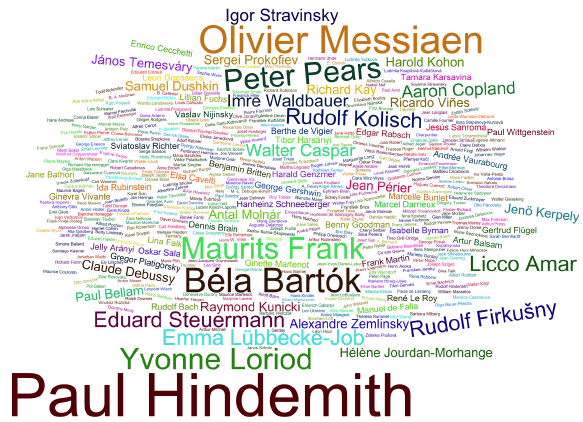

	

		

			

				<h5 class="category mb-2 card-title">Premiere Locations</h5>
				
The location of the first public performance for each source work in the corpus was investigated. Out of 447 venues identified, only 266 still exist. From this research, several countries and cities were identified as centers for new music. At the top, we see United states and France as major centers, with Paris and New York being the premieres cities for a combined total of 140 of the 450 works sampled. Also prominent is the role of Swirtzerland, with Basel, Geneva, and Lausanne counting 29 of the 45 works premiered in Swtzerland. Other important countries include Germany, Czechnia, and Austria, with Vienna, Prague, and Brno being among the leading cities where sampled works were premiered.  

			

		

		

			

			<!-- img src="Premieres_Location_list.png" class="img-fluid rounded-start" alt="Premieres Location" -->
		

	

	

		

			

				<h5 class="category mb-2 card-title">Ensembles</h5>
				
Description goes here

			

		

		

			
		

	

	

		

			

				<h5 class="category mb-2 card-title">Conductors</h5>
				
Description goes here

			

		

		

			
		

	

	

		

			

				<h5 class="category mb-2 card-title">Soloists</h5>
				
Description goes here

			

		

		

			
		

	

