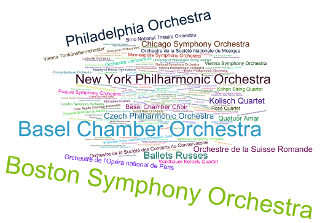

	

		

			

				<h5 class="category mb-2 card-title">Premiere Locations</h5>
				
The location of the first public performance for each source work in the corpus was investigated. Out of 447 venues identified, only 266 still exist. From this research, several countries and cities emerge as centers for new music. At the top, we see United States and France as major centers, with Paris and New York being the premieres cities for a combined total of 140 of the 450 works sampled. Also prominent are Basel, Geneva, and Lausanne counting 29 of the 45 works premiered in Switzerland. Other important countries include Germany, Czechnia, and Austria, with Vienna, Prague, and Brno being among the leading cities where sampled works were premiered.

			

		

		

			

			<!-- img src="Premieres_Location_list.png" class="img-fluid rounded-start" alt="Premieres Location" -->
		

	

	

		

			

				<h5 class="category mb-2 card-title">Ensembles</h5>
				
This word cloud presents the ensembles that were identified for the corpus source works' premieres. Two ensembles are featured prominently, i.e., the Boston Symphony and the Basel Orchestra, which can be explained in part by the fact that both of these organizations were important for the commission of new works in the surveyed period. Also prominently represented are the New York Philarmonic Orchestra and the Philadelphia Orchestra.

			

		

		

			
		

	

	

		

			

				<h5 class="category mb-2 card-title">Conductors</h5>
				
This word cloud represents the conductors identified for source works' premieres. The relation with specific orchestra is clearly represented, with Paul Sacher (the founder and director of the Basel Orchestra from 1926 to 1987) and Serge Koussevitsky (the director of the Boston Symphony Orchestra from 1924 to 1949). Also notable is Ernest Ansermet, a Swiss conductor who worked with Diaghilev's Ballet Russes from 1915 to 1923, and founded his own orchestra in 1918, the Orchestre de la Suisse Romande, with which he toured Europe and the United States. Premiered works by Ansermet and the Orchestra de la Suisse Romande include Igor Stravinsky's Symphonic Poem, <i>Pesnya solov′ya</i> (Song of the Nightingale), in Geneva, Switzerland, and several works by the Swiss composer Frank Martin (1890-1974).

			

		

		

			
		

	

	

		

			

				<h5 class="category mb-2 card-title">Soloists</h5>
				
This word cloud presents soloists involved in the premiere of corpus source works. Of note is the premiere of works by composers, including Paul Hindemith, Olivier Messiaen, and Béla Bartók. Also prominent is the role of Yvonne Loriod (1924-2010), a French pianist, teacher and composer, as well as Messiaen's second wife, who premiered eight of Messiaen's piano works featured in the corpus. Other soloists featured are Peter Pears (1910-1986), an English tenor who premiered several corpus works by Benjamin Britten, and Maurits Frank (1982-1959), a leading cellist of his time, who was featured in several of Hindemith's chamber works as well as Anton Webern's <i>Sechs Bagatellen</i> (Six Bagatellen) for String Quartet, op. 9 (Web-12).

			

		

		

			
		

	

