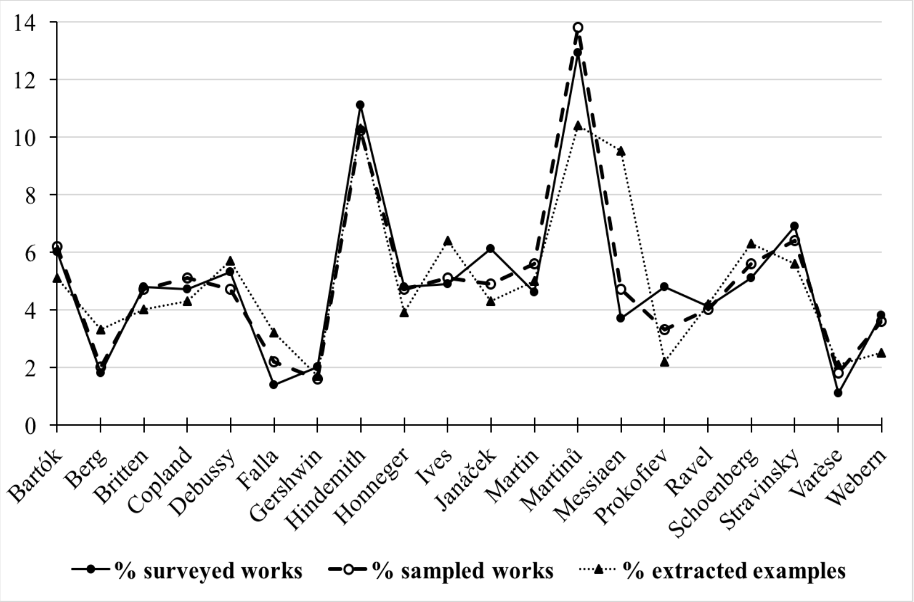
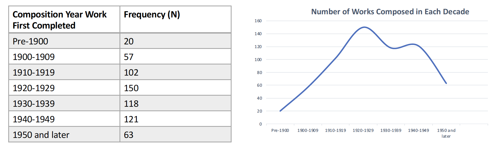
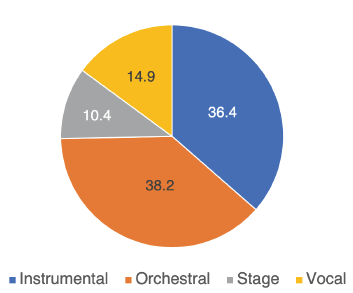
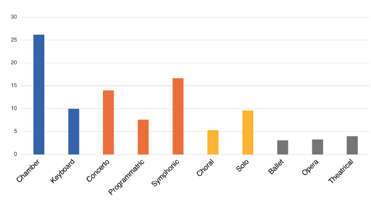

	

		

			
		

		

			

				<h5 class="category mb-2 card-title">Works by Composer</h5>
				
Description goes here

			

		

	

	

		

			
		

		

			

				<h5 class="category mb-2 card-title">Works & Examples</h5>
				
Description goes here

			

		

	

	

		

			
		

		

			

				<h5 class="category mb-2 card-title">Composition Year by Decade</h5>
				
Description goes here

			

		

	

	

		

			
		

		

			

				<h5 class="category mb-2 card-title">Genre Percentage Distribution</h5>
				
Description goes here

			

		

	

	

		

			
		

		

			

				<h5 class="category mb-2 card-title">Sub-genre Percentage Distribution</h5>
				
Description goes here

			

		

	

