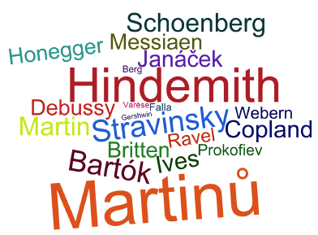

	

		

			
		

		

			

				<h5 class="category mb-2 card-title">Works by Composer</h5>
				
Description goes here

			

		

	

	

		

			

				<h5 class="category mb-2 card-title">Works & Examples</h5>
				
Description goes here

			

		

		

			
		

	

	

		

			

				<h5 class="category mb-2 card-title">Composition Year by Decade</h5>
				
Description goes here

			

		

		

			<table>
				<tr>
					<td style="padding-left: 20px; vertical-align:top">

</td>
					<td style="padding-left:100px; vertical-align:top">

</td>
				</tr>
			</table>
			<!-- img src="Composition_Year_by_Decade_table_graph.png" class="img-fluid rounded-start" alt="Composition Year by Decade" -->
		

	

	

		

			<!-- img src="Genre_Percentage_Distribution_graph.png" class="img-fluid rounded-start" alt="Genre Percentage Distribution" -->
			

		

		

			

				<h5 class="category mb-2 card-title">Genre Percentage Distribution</h5>
				
Description goes here

			

		

	

	

		

			<!-- img src="Sub-genre_Percentage_Distribution_graph.png" class="img-fluid rounded-start" alt="Sub-genre Percentage Distribution" -->
			

		

		

			

				<h5 class="category mb-2 card-title">Sub-genre Percentage Distribution</h5>
				
Description goes here

			

		

	

