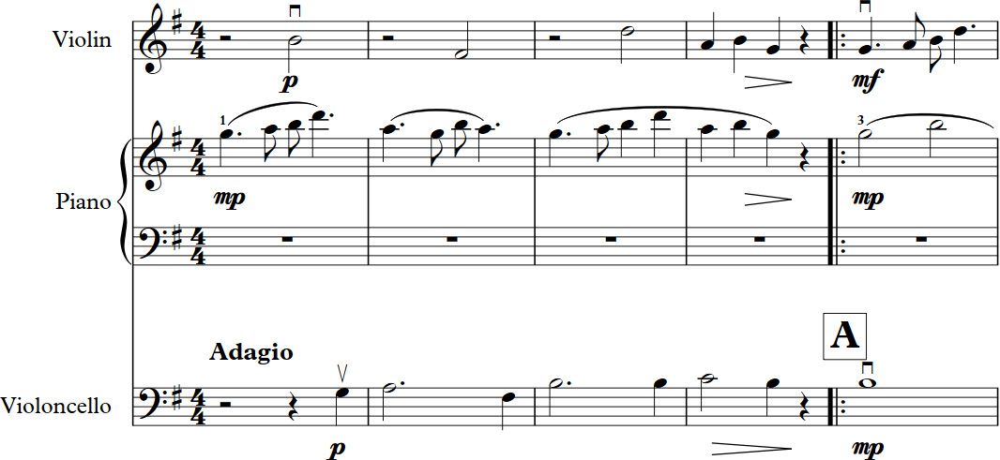




<!-- Sample Work -->
<section>
	

		

			

				

					<h2>Sample work: Charles Ives, Largo for Violin Clarinet and Piano</h2>
				

			

		

		<!-- Browse by -->
		

			

				
<small>Browse by</small>

				<!-- Composer -->
				

					<select id="composerSelect" class="form-select form-select--primary" aria-label="Composer">
						<option selected>Composer</option>
						<option value="1">One</option>
						<option value="2">Two</option>
						<option value="3">Three</option>
					</select>
				

				<!-- Genre -->
				

					<select id="genreSelect" class="form-select form-select--primary" aria-label="Genre">
						<option selected>Genre</option>
						<option value="1">One</option>
						<option value="2">Two</option>
						<option value="3">Three</option>
					</select>
				

				<!-- Premiered -->
				

					<select id="premieredSelect" class="form-select form-select--primary" aria-label="Premiered">
						<option selected>Premiered</option>
						<option value="1">One</option>
						<option value="2">Two</option>
						<option value="3">Three</option>
					</select>
				

			

			<!-- Listen -->
			

				
<small>Listen</small>

				
			

		

		<!-- Image -->
		

			

				

					
				

			

		

		

			

				<!-- Example page -->
				<button type="button" class="btn btn-secondary btn-secondary-dark float-md-end mb-3 mb-lg-0 ms-1">
					Example page
				</button>
				<!-- Coincidence -->
				<button type="button" class="btn btn-secondary float-md-end mb-3 mb-lg-0 ms-1">
					Coincidence
				</button>
				<!-- Composite -->
				<button type="button" class="btn btn-secondary float-md-end mb-3 mb-lg-0 ms-1">
					Composite
				</button>
				<!-- Group color -->
				<button type="button" class="btn btn-secondary float-md-end mb-3 mb-lg-0">
					Group color
				</button>
			

		

	

</section>

<!-- Project Resources-->
<section>
	

		

			

				

					<h2>Project Resources</h2>
				

			

		

		

			<!-- 1 -->
			

				

					
					

						
UPDATES

						<a class="text-decoration-none link-dark stretched-link" href="updates" role="button"><h3 class="card-title mb-3">Upcoming conference presentations at ESCOM 2024, July 3–6, and SMPC, July 25-28.</h3></a>
					

				

			

			<!-- 2 -->
			

				

					
					

						
ABOUT

						<a class="text-decoration-none link-dark stretched-link" href="overview" role="button"><h3 class="card-title mb-3">This platform presents an online edition of 750 examples of polyphonic music with information about composers and their works.  You can explore our sources, listen to the music excerpts, use the analysis tools, and participate in an experiment.</h3></a>
					

				

			

			<!-- 3 -->
			

				

					
					

						
RESEARCH

						<a class="text-decoration-none link-dark stretched-link" href="research" role="button"><h3 class="card-title mb-3">We explore polyphonic music through close study, computational analysis, and listening experiments. To learn more, consult our publications, presentations, and website resources. </h3></a>
					

				

			

			<!-- 4 -->
			

				

					
					

						
MAPS

						<a class="text-decoration-none link-dark stretched-link" href="maps" role="button"><h3 class="card-title mb-3">The Suter (1980) Corpus is represented by three interactive maps.  Maps feature composers' lifetime and places where the corpus works were first performed.</h3></a>
					

				

			

			<!-- 5 -->
			

				

					
					

						
TOOLS

						<a class="text-decoration-none link-dark stretched-link" href="tools" role="button"><h3 class="card-title mb-3">Visit the analysis page for interactive graphs of the corpus data.  Each example page also features interactive representations of the rhythmic structure.</h3></a>
					

				

			

			<!-- 6 -->
			

				

					
					

						
SOURCES

						<a class="text-decoration-none link-dark stretched-link" href="sources" role="button"><h3 class="card-title mb-3">Learn more about the publications and recordings used in the creation of this digital edition.</h3></a>
					

				

			

		

	

</section>

